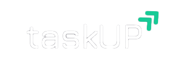
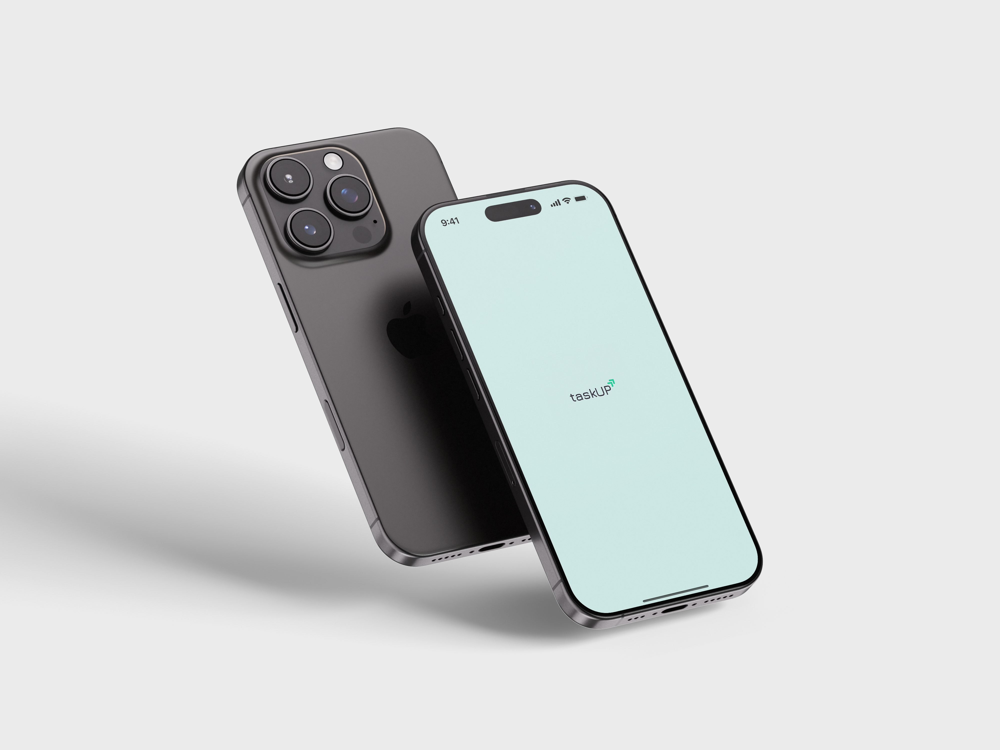

## A Flutter Based Application Created For iOS Platform ##

### Overview: ###

#### taskUP is a feature-rich to-do list application built using Flutter, specifically optimized for the iOS platform. Designed to boost productivity, this app combines a simple yet an intuitive user interface with smart task management features, helping users stay focused, organized, and on schedule. ####

 ### The app includes several key features aimed at enhancing task management and user experience: ###
 
- **Welcome Screen: A smooth intro screen displaying the app name for 0.3-0.5 seconds.**

- **Thematic Customization: Users can personalize the app with custom themes, colors, and backgrounds to suit their preferences.**

- **Local Notifications: The app sends reminders for upcoming tasks, ensuring users stay on track.**

- **Location-Based Reminders: Tasks can be triggered based on the user’s location, providing more context-driven notifications.** 

- **Focus Modes/Pomodoro Integration: A Pomodoro timer to encourage productivity and ensure task completion with focused work intervals.** 

## Technologies Used: ##

#### - Flutter – for building the cross-platform mobile UI ####

#### - Dart – as the core programming language ####

#### - Flutter Local Notifications – to implement task reminders ####

#### - Geolocator / Location – for location-based reminder functionality ####
